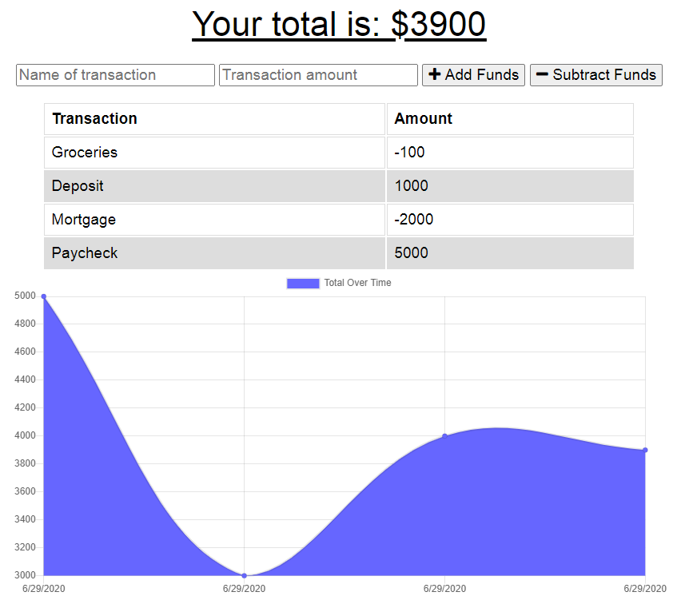

# Online-Offline-Budget-Trackers

  ## Description
  The user will be able to add expenses and deposits to their budget with or without a connection. When entering transactions offline, they should populate the total when brought back online.

  Link to deployed application: https://secure-eyrie-61403.herokuapp.com/
  
  

  ## Table of Contents
  * [Installation](#installation)
  * [Usage](#usage)
  * [License](#license)
  * [Contributing](#contributing)
  * [Test](#tests)
  * [Questions](#questions) 

  ## Installation
  Offline Functionality:

  * Enter deposits offline

  * Enter expenses offline

  When brought back online:

  * Offline entries should be added to tracker.

  ## Usage
  AS AN avid traveller
  I WANT to be able to track my withdrawals and deposits with or without a data/internet connection
  SO THAT my account balance is accurate when I am traveling

  ## License
  © 2020 Kate Meersman brand. All Rights Reserved. 

  

  ## Contributing
  Kate Meersman

  ## Tests

  

  ## Questions
  * katie4682@yahoo.com